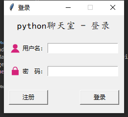

# socket聊天室
一个 python 的 socket 的聊天室

## 更新

- 2020-04-24 更新README.md

## 使用

- 下载源码

- 在控制台执行命令：socketServer.py文件

- 最后运行client.py

## 界面

具体设计可查看：[socket聊天室](https://www.cnblogs.com/yang-2018/p/12765470.html)
